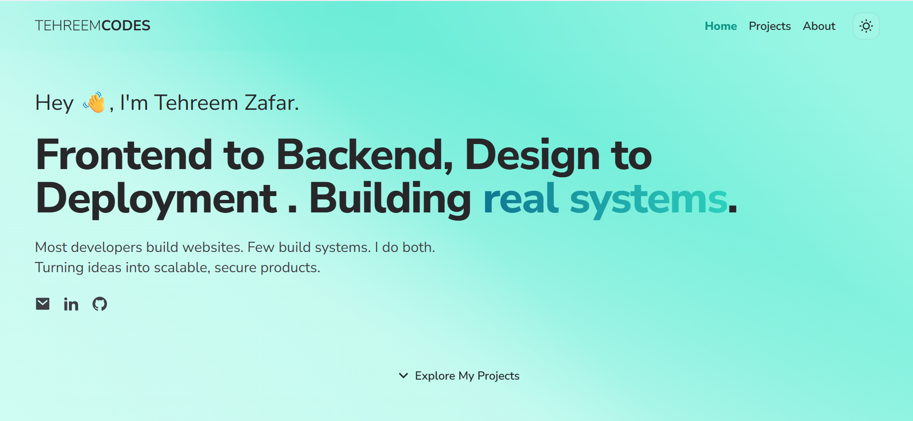

# Tehreem Zafar – Portfolio Website

This is my personal portfolio website built from scratch using React, Tailwind CSS, and Vite. It highlights my skills, showcases selected projects, and offers a way to connect with me professionally.

## 📺 Preview


## 🚀 Features

- ⚡ Fast and lightweight (Vite + React)
- 🎨 Fully responsive and mobile-friendly design
- 🌙 Dark mode support (if added)
- 🧩 Modular and clean component structure
- 🧰 Tailwind CSS for rapid styling

## 🛠️ Built With

- [React](https://reactjs.org/)
- [Vite](https://vitejs.dev/)
- [Tailwind CSS](https://tailwindcss.com/)
- [React Icons](https://react-icons.github.io/react-icons/) (optional)
- [Framer Motion](https://www.framer.com/motion/) (for animations, if used)

## 📁 Folder Structure
tehreem-portfolio/
├── public/
├── src/
│ ├── assets/
│ ├── components/
│ ├── pages/
│ └── App.jsx
├── .gitignore
├── index.html
├── package.json
└── tailwind.config.js

## 💻 Getting Started

Clone the repository and install dependencies:

```bash
git clone https://github.com/tehreemcodes/tehreem-portfolio.git
cd tehreem-portfolio
npm install
npm run dev
```

## 📬 Contact
Feel free to reach out via [LinkedIn](https://linkedin.com/in/tehreem-zafar) or email me at [tehreem.zafar06@gmail.com](mailto:tehreem.zafar06@gmail.com).

## ✨ Live Demo
Visit my portfolio here: [TEHREEMCODES](https://tehreemcodes.netlify.app/)
